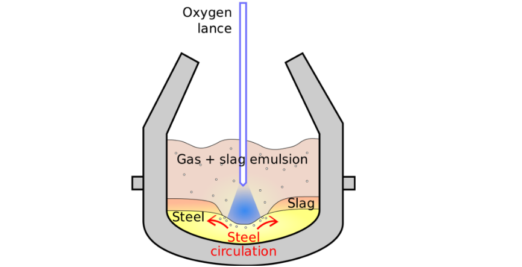
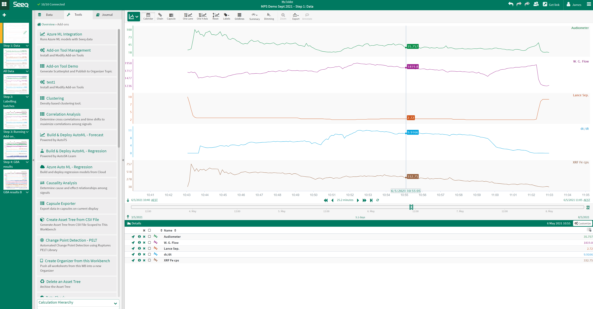
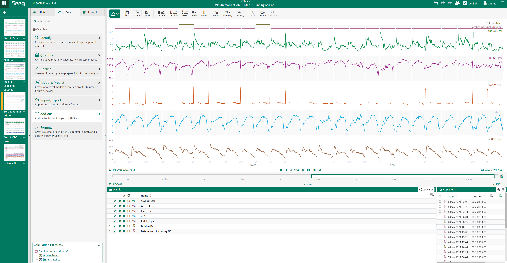
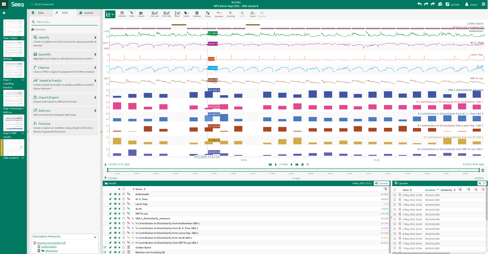
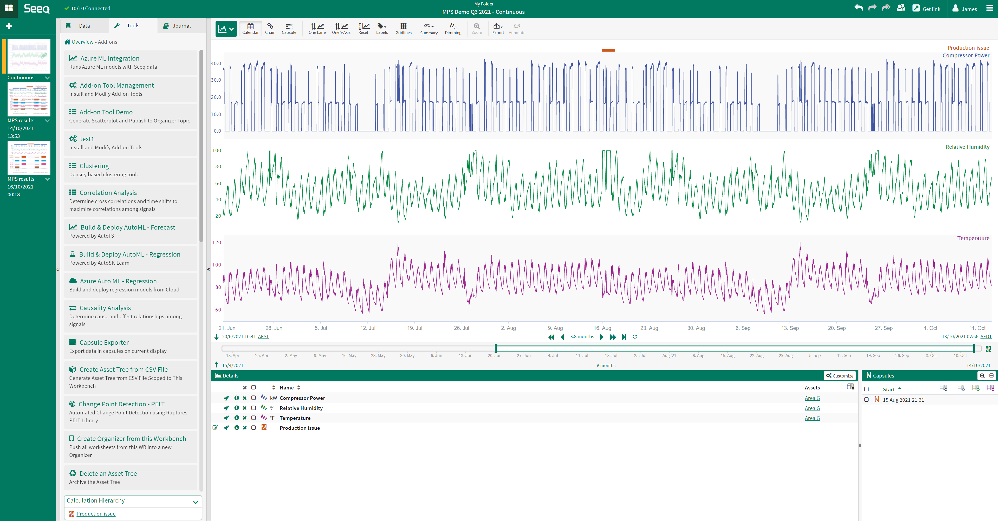
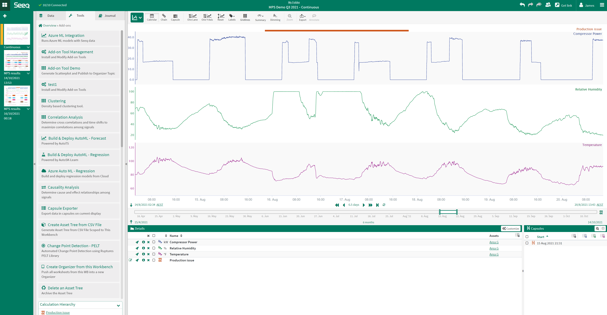
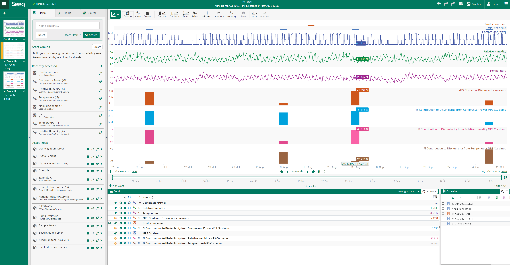
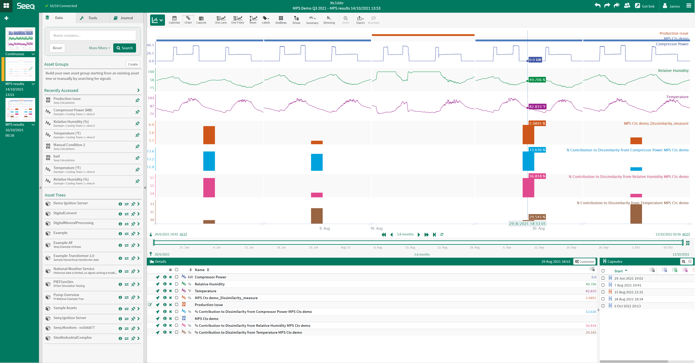

# Example Use Cases

This set of use cases is a small subset of the typical types of analyses that can be conducted using the
**seeq-mps** Add-on.

## Example Use Case 1. Batch Mode: Golden batch analysis

This use case will display the **seeq-mps** Add-on ability to perform golden batch analysis.

The basic oxygen steelmaking (BOS) process converts pig iron into steel by blowing oxygen through a lance into the
process vessel to remove carbon from the batch of iron. Figure 1 shows a diagram of a typical BOS process unit. The 
BOS dataset used for this use case comprises the following time series data shown in Figure 2:

- Audiometer – audiometer reading, sensitive to the level of slag
- W. G. Flow – waste gas flow rate (WGF)
- Lance Sep – lance separation (height above the bath containing steel)
- dc/dt – rate of carbon leaving vessel
- XRF Fe cps – Xray fluorescence Fe in waste gas in counts per second

 
<table border="0">
 <tr>
    <td></td>
 </tr>
 <tr>
    <td>Figure 1. Basic oxygen Steelmaking (BOS) process unit.</td>
 </tr>
</table>
  

<table border="0">
 <tr>
    <td></td>
 </tr>
 <tr>
    <td>Figure 2. Basic oxygen Steelmaking (BOS) example signal trends for a single batch.</td>
 </tr>
</table>
  

Operators and engineers monitoring batch processes refer to a reference batch with optimal performance metrics a 'golden
batch', it is typical to review and compare every subsequent batch produced against this golden batch. Figure 3 shows 
many batches of the BOS process with conditions indicating which batches are golden and which are batches to be assessed 
in comparison (purple). The **seeq-mps** Add-on provides a comparison of each batch against the 'golden batch' set. 
The enables batch assessments without having to wait for lab results for each new batch. Figure 4 below  
displays the result output from the **seeq-mps** Add-on run in batch mode on this dataset. The blue bar signal shows the 
output % dissimilarity measured by the Add-on, with all subsequent bar signals detailing each variable's contribution to 
the corresponding batch's measured % dissimilarity. 

 
<table border="0">
 <tr>
    <td></td>
 </tr>
 <tr>
    <td>Figure 3. Basic oxygen Steelmaking (BOS) example signal trends all batches.</td>
 </tr>
</table>
  

<table border="0">
 <tr>
    <td></td>
 </tr>
 <tr>
    <td>Figure 4. Basic oxygen Steelmaking (BOS) example with seeq-mps Add-on results.</td>
 </tr>
</table>
  

Insights gained: 
- Dissimilarity signal gives a quantitative measure of batch performance as soon as the batch is completed.
- Variable contribution signals assist corrective action investigations by highlighting problem areas

## Example Use Case 2. Continuous Mode: Bad actor search

This use case will display the  ability of **seeq-mps**  to search for similar process events for continuous processes.

A continuous process dataset from a Cooling Tower is used for this example, it comprises the following time series data
shown in Figure 5:
- Compressor power (kW)
- Relative humidity (%)
- Temperature (def F)

 
<table border="0">
 <tr>
    <td></td>
 </tr>
 <tr>
    <td>Figure 5. Cooling Tower example signal trends.</td>
 </tr>
</table>
  

When a production issue occurs, it is often extremely valuable starting point for operations personnel to 
find other, similar instances in history. **seeq-mps** can help accelerate this search. The start and end time of the 
production issue is known and a condition is created to add context using Seeq Workbench. Figure 6 shows a zoomed view 
of Figure 5 to highlight the details in the known production issue condition (in this case a single capsule).

 
<table border="0">
 <tr>
    <td></td>
 </tr>
 <tr>
    <td>Figure 6. Cooling Tower example production issue zoomed in.</td>
 </tr>
</table>
  

**seeq-mps** finds 4 other similar production issues in the dataset (shown in figures 7 and 8). The results are sent 
back to the user's workbook as a new worksheet. Each identified event has a % dissimilarity value; this allows quick 
identification of events that have the same characteristics as the latest undesirable production event. Each signal has 
a % contribution value - this is the influence of the signal on the overall dissimilarity. The % contribution is useful 
to identify potential bad actors that may be good candidates to focus initial troubleshooting efforts.  

 
<table border="0">
 <tr>
    <td></td>
 </tr>
 <tr>
    <td>Figure 7. Cooling Tower example seeq-mps results.</td>
 </tr>
</table>
  

<table border="0">
 <tr>
    <td></td>
 </tr>
 <tr>
    <td>Figure 8. Cooling Tower example seeq-mps results chain view.</td>
 </tr>
</table>
  